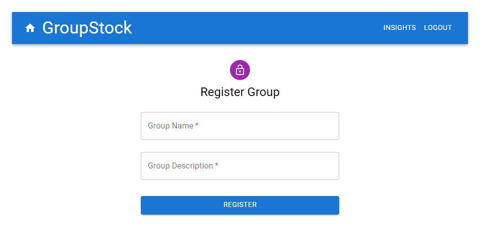

# GroupStock

GroupStock is a stock watch list web application focused on providing users the
ability to create and manage stock watchlists. Users are also able to join and
create groups where they can view a curated stock watch list.

## Building

1. `npm install` in the root directory and inside of the `client` folder.
2. Run `npm dev` to startup both the Express server and the React client.
